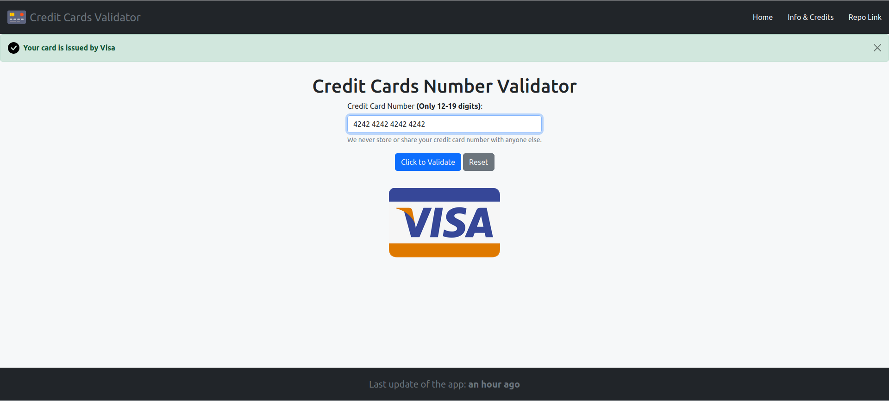
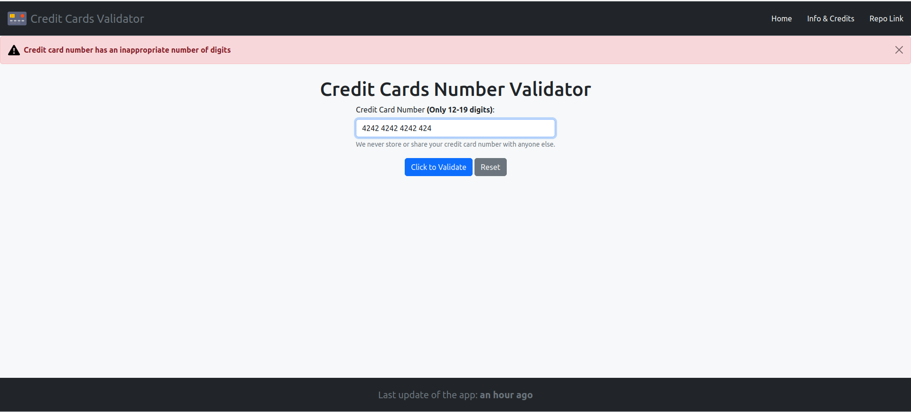
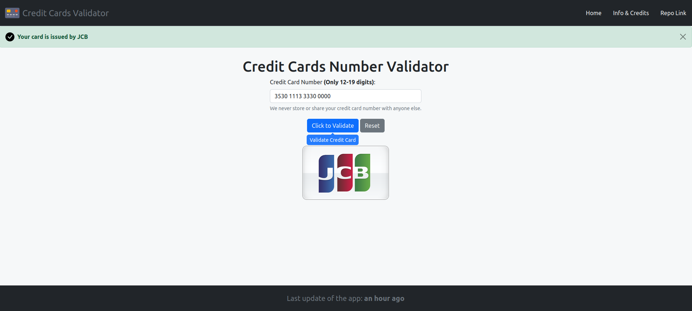
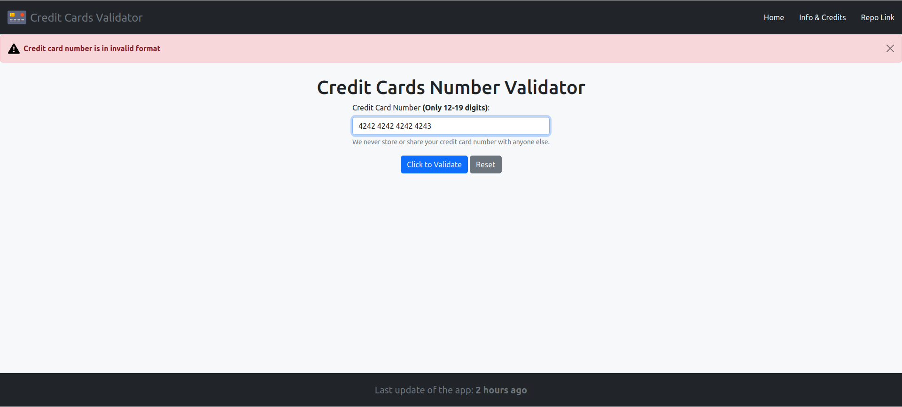

# Express EJS Stack Credit Cards Validator

Node, Express, Less and EJS Stack App for Credit Cards Number Verification.

Link to the application: [https://node-card-validator.herokuapp.com](https://node-card-validator.herokuapp.com)

## Description

### General Info

The app uses **[Luhn algorithm](https://en.wikipedia.org/wiki/Luhn_algorithm)**, prefixes and number length to validate
credit cards. The algorithm was taken from
[Rosetta Code](https://rosettacode.org/wiki/Luhn_test_of_credit_card_numbers#JavaScript) and
[LearnersBucket](https://learnersbucket.com/examples/javascript/credit-card-validation-in-javascript).

You can use these credit card numbers (or your own card - the numbers aren't saved anywhere) to test the app:\
Visa: **`4242424242424242`**,\
American Express: **`371449635398431`** or **`3400 0000 0000 009`**,\
Dinners Club: **`30569309025904`**,\
Discover: **`6011111111111117`**,\
JCB: **`3530111333300000`**,\
Maestro: **`6763-0903-0733-1012`**\
Visa Electron: **`4917300800000000`**,\
Master Card: **`5500 0000 0000 0004`**.

## Notes

The .env file is not hosted on [GitHub.com](https://github.com).\
I have some packages installed globally (e.g. TypeScript, Nodemon) so you have to install them manually.

## ScreenShots

## Built With

- The App is written in [TypeScript](https://www.typescriptlang.org)'
- [Express](https://expressjs.com) is used to build server-side'
- [EJS](https://ejs.co) is used to generate HTML'
- [Less](https://lesscss.org) and [Bootstrap](https://getbootstrap.com) are used to style the app'.

## License

[MIT](https://choosealicense.com/licenses/mit)
